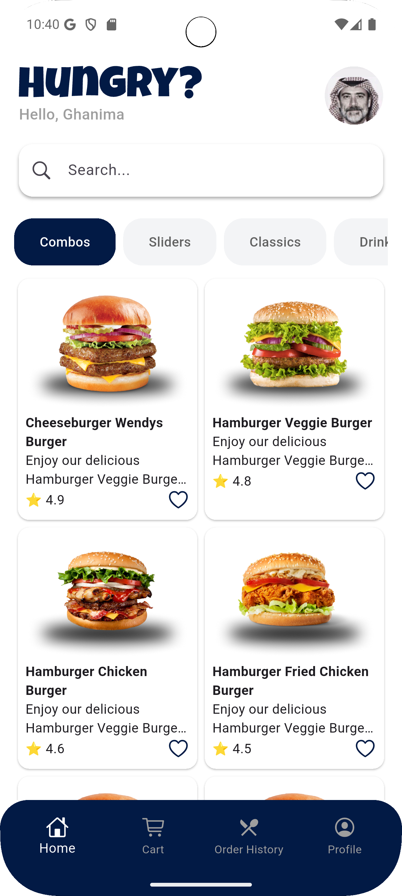
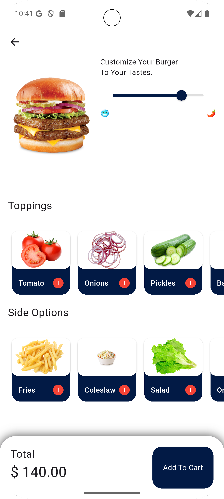
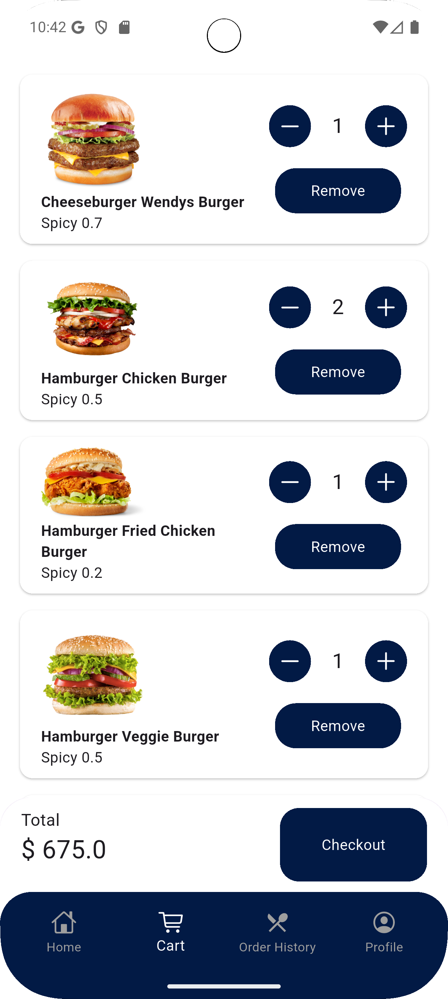
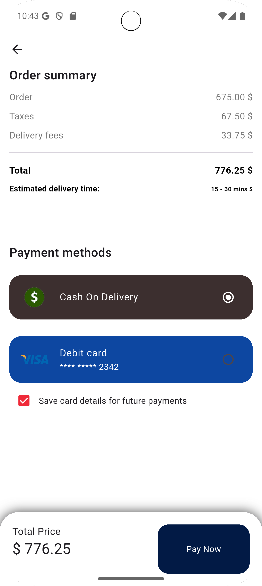
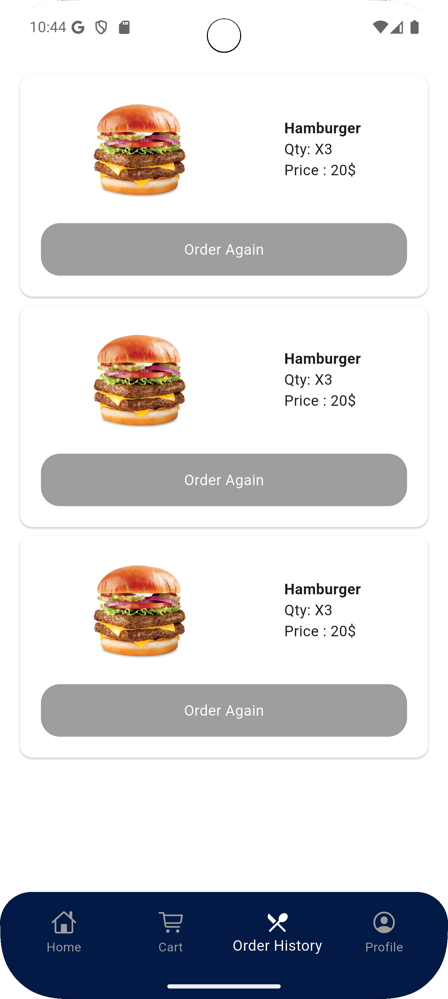
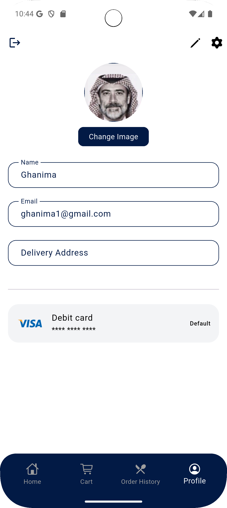

<p align="center">
  
</p>

# Hungry App 🍔

Food Ordering Mobile Application built with **Flutter** using **Clean Architecture** and **Cubit (BLoC)**.

Hungry App is a modern food ordering mobile application that allows users to browse meals, manage their cart, and complete checkout with a clean and responsive UI.

---

## 🚀 Features

* User Authentication (Login / Register / Guest Mode)
* Browse Meals & Categories
* Product Details
* Cart Management
* Checkout Process
* Order History
* Profile Management
* REST API Integration
* Responsive UI (Android & iOS)

---

## 🛠️ Tech Stack

* Flutter & Dart
* Clean Architecture
* Cubit (BLoC State Management)
* REST APIs
* Dependency Injection
* Custom UI Components

---

## 📱 App Screenshots

<table align="center">
<tr>
<td></td>
<td></td>
<td></td>
</tr>

<tr>
<td></td>
<td></td>
<td></td>
</tr>

<tr>
<td></td>
<td></td>
<td></td>
</tr>
</table>

---

## 📂 Project Structure

```
lib
│
├── core
│   ├── constants
│   ├── di
│   └── network
│
├── data
│   ├── data_source
│   ├── model
│   └── repositories
│
├── domain
│   ├── entities
│   ├── repositories
│   └── use_case
│
├── features
│   ├── auth
│   ├── home
│   ├── product
│   ├── cart
│   ├── checkout
│   ├── orderHistory
│   ├── profile
│   └── root
│
├── shared
│
├── splash.dart
└── main.dart
```

---

## 🧠 Architecture

This project follows **Clean Architecture** to keep the code scalable and maintainable.

Layers:

**Presentation Layer**

* UI
* Cubit (State Management)

**Domain Layer**

* Entities
* Use Cases
* Repository Contracts

**Data Layer**

* Models
* Repository Implementations
* API Data Sources

---

## 👨‍💻 Author

**Abdelrahman Ghanima**
Flutter Mobile Application Developer

---

## ⭐ Show Your Support

If you like this project, give it a ⭐ on GitHub!
